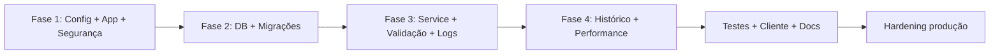

# Roteiro de Replicação — API Node.js + Express + PostgreSQL

Este documento descreve como **replicar a arquitetura e as práticas** de APIs Node.js + Express + PostgreSQL em sistemas com regras de negócio e persistência relacional.

No repositório **`api_network`**, o domínio é **mapeamento de rede** (switches, APs, impressoras, relógios de ponto, catracas, antenas de ramais) — use `REFACTOR_PLAN.md` como fonte de verdade do domínio.

Use-o como **checklist executável** por fases. Adapte nomes de domínio (`devices`, `topology`, etc.) para o seu contexto.

---

## 1. Objetivo do padrão

Construir uma API com:

- Separação clara: **Route → Controller → Service → Model**
- Configuração validada na subida
- Segurança básica (headers, rate limit em escrita)
- PostgreSQL com pool, SQL parametrizado e migrações versionadas
- Erros padronizados em JSON
- Logs estruturados
- Testes unitários e de integração HTTP
- Graceful shutdown
- Documentação OpenAPI (Swagger)
- Cliente HTTP para carga em lote (opcional)

**Nível alvo:** júnior avançado → pleno (API interna ou MVP). Para produção pública, inclua também autenticação (ver seção 10).

---

## 2. Estrutura de pastas (template)

```text
projeto/
├── index.js                    # bootstrap: createApp + listen + shutdown
├── knexfile.cjs                # config de migrações
├── Dockerfile
├── .env_example
├── package.json
├── config/
│   └── db.js                   # Pool PostgreSQL
├── db/
│   └── migrations/knex/        # migrações versionadas
├── scripts/
│   └── sendManyData.js         # seed/carga em lote (opcional)
├── logs/                       # ignorado no git
└── src/
    ├── app.js                  # factory Express (testável)
    ├── config/
    │   ├── env.js              # validação Zod
    │   ├── logger.js           # Pino
    │   └── swagger.js          # OpenAPI
    ├── routes/
    │   └── <recurso>Routes.js
    ├── controllers/
    │   └── <recurso>Controller.js
    ├── services/
    │   └── <recurso>Service.js # regras de negócio puras
    ├── model/
    │   └── <recurso>Model.js   # SQL parametrizado
    ├── middlewares/
    │   ├── asyncHandler.js
    │   ├── errorHandler.js
    │   ├── validateInput.js
    │   └── rateLimit.js
    ├── utils/
    │   └── HttpError.js
    ├── clients/                # opcional: SDK/consumidor da API
    │   └── ApiClient.js
    └── integration/            # testes HTTP com servidor real em porta 0
        └── httpRoutes.integration.test.js
```

---

## 3. Dependências recomendadas

### Produção

| Pacote | Uso |
|--------|-----|
| `express` | HTTP |
| `pg` | PostgreSQL (Pool) |
| `dotenv` | Variáveis de ambiente |
| `zod` | Validação de env e payloads |
| `helmet` | Headers de segurança |
| `express-rate-limit` | Limite em rotas de escrita |
| `cors` | CORS (restrinja em produção) |
| `pino` | Logs estruturados |
| `swagger-jsdoc` + `swagger-ui-express` | Documentação |
| `moment-timezone` | Timestamps com fuso (ou `Temporal`/`date-fns-tz` em projetos novos) |

### Desenvolvimento

| Pacote | Uso |
|--------|-----|
| `knex` | Migrações |
| `nodemon` | Hot reload |
| `eslint` + `eslint-config-prettier` | Lint |
| `prettier` | Formatação |

Testes: **`node:test`** (nativo, sem Jest obrigatório).

---

## 4. Variáveis de ambiente

Arquivo `.env_example`:

```env
PORT=3000
DB_HOST=localhost
DB_PORT=5432
DB_USER=postgres
DB_PASSWORD=changeme
DB_NAME=my_database
LOG_LEVEL=info
```

Arquivo `src/config/env.js`:

- Carregar `dotenv`
- Schema Zod com `safeParse`
- Lançar erro legível se inválido **antes** de subir o servidor

---

## 5. Fases de implementação

### Fase 1 — Arquitetura e configuração

| # | Tarefa | Critério de aceite |
|---|--------|-------------------|
| 1.1 | Criar `src/config/env.js` com Zod | App não inicia com env inválida |
| 1.2 | Extrair Swagger para `src/config/swagger.js` | `index.js` / `app.js` sem definição inline |
| 1.3 | Criar `src/app.js` com `createApp()` | Testes podem instanciar app sem `listen` |
| 1.4 | Configurar `helmet` e `cors` | Headers de segurança ativos |
| 1.5 | Rate limit só em rotas de **escrita** | POST/PUT bloqueiam após limite (ex.: 100/15min) |

**Entregável:** servidor sobe, `/docs` responde, rotas montadas.

---

### Fase 2 — Banco de dados e confiabilidade

| # | Tarefa | Critério de aceite |
|---|--------|-------------------|
| 2.1 | `config/db.js` com `Pool` do `pg` | Conexões reutilizadas |
| 2.2 | Model com queries **sempre** parametrizadas (`$1`, `$2`…) | Nenhuma concatenação de input em SQL |
| 2.3 | Knex + `knexfile.cjs` | `npm run migrate:latest` cria schema |
| 2.4 | Migração: tabela principal | Tabela do domínio criada |
| 2.5 | Migração: índice em coluna temporal | Ex.: `idx_<tabela>_hour` em coluna usada em gráficos |
| 2.6 | Graceful shutdown em `index.js` | `SIGTERM`/`SIGINT` → `server.close()` + `pool.end()` |

Scripts no `package.json`:

```json
"migrate:latest": "knex migrate:latest --knexfile knexfile.cjs",
"migrate:rollback": "knex migrate:rollback --knexfile knexfile.cjs",
"migrate:status": "knex migrate:list --knexfile knexfile.cjs"
```

**Entregável:** banco versionado; deploy roda migração antes da API.

---

### Fase 3 — Lógica de negócio, validação e observabilidade

| # | Tarefa | Critério de aceite |
|---|--------|-------------------|
| 3.1 | Service com funções puras (ex.: decodificar bits, calcular campos) | Testável sem HTTP/DB |
| 3.2 | Middleware `validateInput` com Zod no POST | Payload inválido → `400` + detalhes |
| 3.3 | `HttpError` + `asyncHandler` + `errorHandler` | Sem `try/catch` repetido nos controllers |
| 3.4 | Logger Pino em arquivo (`logs/app.log`) | Sem `console.log` em produção |
| 3.5 | Controller fino: delega para service/model | Controller só orquestra req/res |

Padrão de erro JSON:

```json
{ "error": "Mensagem legível" }
```

Para `500`, mensagem genérica; detalhes só no log.

**Entregável:** POST validado; erros consistentes; regras no service.

---

### Fase 4 — Performance e histórico (opcional)

| # | Tarefa | Critério de aceite |
|---|--------|-------------------|
| 4.1 | Endpoint de histórico com buckets (ex.: `GET /api/<recurso>/last2h`) | Janela fixa (ex. 2h), intervalo 30min, `LIMIT` coerente |
| 4.2 | Query com `generate_series` + `LEFT JOIN` | Buckets mesmo sem dados no período |
| 4.3 | Documentar decisão de framework (Express vs Fastify) | Arquivo `PERFORMANCE_NOTES.md` |

Exemplo de janela (2h, buckets de 30min = 4 pontos):

- `INTERVAL '2 hours'`
- `LIMIT 4`

**Entregável:** gráfico do front recebe série contínua.

---

## 6. Contrato de API (modelo genérico)

Adapte o prefixo `/api/<recurso>`:

| Método | Rota | Descrição |
|--------|------|-----------|
| `GET` | `/` | Lista (com limite, ex. 100) |
| `GET` | `/last2h` | Histórico agregado para gráfico |
| `GET` | `/:id` | Busca por ID (regex só dígitos) |
| `POST` | `/` | Cria registro (body JSON validado) |
| `GET` | `/insert` | **Somente dev/teste** — evitar em produção |

Payload POST típico:

```json
{
  "wlevel": 55,
  "state": 32,
  "pump_aux": true,
  "wvol": 900
}
```

---

## 7. Camadas — responsabilidades

| Camada | Responsabilidade | Não deve |
|--------|------------------|----------|
| **Route** | Método HTTP, middlewares, Swagger annotations | SQL, regra de negócio |
| **Controller** | Extrair req, chamar service, status HTTP | SQL direto |
| **Service** | Regras, transformações, defaults | Conhecer Express (`req`/`res`) |
| **Model** | SQL parametrizado, mapear rows | Validação de HTTP |

---

## 8. Testes (mínimo recomendado)

### Unitários

- Funções puras do **service** (ex.: decodificação de bits)
- **Middleware** de validação (aceita / rejeita)
- **errorHandler** (4xx vs 5xx)
- **asyncHandler** (propaga erro para `next`)
- **Model** (verifica SQL com `$1…` via mock de `pool.query`)
- **Rate limit** (bloqueia após N requisições)

### Integração HTTP

- `createApp()` + `app.listen(0)` + `fetch` nativo
- `GET /`, `POST /` válido/inválido, `GET /:id` 404, `GET /last2h`, `GET /docs`

Script:

```json
"test": "node --test src/**/*.test.js"
```

Meta: **≥ 20 testes** cobrindo camadas críticas antes de considerar “replicado”.

---

## 9. Cliente para vários dados (opcional)

Classe `ApiClient` com:

- `createOne(payload)`
- `createMany(records, { concurrency, continueOnError })`
- `getAll()`, `getById(id)`, `getLast2h()`
- `static generateSampleRecords(count)` para testes

Script:

```bash
npm run seed:many -- 50
```

Útil para popular gráficos e testes de carga leve.

---

## 10. Segurança — aplicar ao replicar

Itens **não** cobertos pelo padrão mínimo, mas recomendados antes de expor na internet:

- [ ] Autenticação (API Key, JWT ou gateway)
- [ ] Remover ou proteger rota `GET /insert`
- [ ] Rate limit também em rotas de leitura pesada
- [ ] `trust proxy` se estiver atrás de Nginx/Load Balancer
- [ ] CORS restrito a origens conhecidas
- [ ] TLS no reverse proxy
- [ ] `npm audit` no CI
- [ ] Secrets fora do repositório (`.env` no `.gitignore`)

---

## 11. Docker e deploy

### Dockerfile (aplicação)

```dockerfile
FROM node:20-alpine
WORKDIR /app
COPY package*.json ./
RUN npm install --omit=dev
COPY . .
EXPOSE 3000
CMD ["npm", "start"]
```

### Fluxo de deploy

1. Subir PostgreSQL (container ou gerenciado)
2. `npm run migrate:latest`
3. `npm start` (ou imagem Docker)
4. Health check em `GET /api/<recurso>/` ou rota dedicada `/health`

---

## 12. Checklist final (copiar para o novo projeto)

### Infra e código

- [ ] `src/app.js` com `createApp()`
- [ ] `src/config/env.js` (Zod)
- [ ] `src/config/swagger.js`
- [ ] `src/config/logger.js` (Pino)
- [ ] `config/db.js` (Pool)
- [ ] Route / Controller / Service / Model
- [ ] `asyncHandler` + `errorHandler` + `HttpError`
- [ ] Validação Zod no POST
- [ ] `helmet` + rate limit em escrita
- [ ] Knex + migrações aplicadas
- [ ] Índice em coluna temporal
- [ ] Graceful shutdown
- [ ] Dockerfile da aplicação

### Qualidade

- [ ] ESLint + Prettier
- [ ] Testes unitários (service, middlewares, model)
- [ ] Testes de integração HTTP
- [ ] README com endpoints e scripts
- [ ] `MIGRATIONS.md` e `PERFORMANCE_NOTES.md` (opcional)

### Domínio (exemplo api_network)

- [ ] Validação por `device_type` (switch, ap, printer, time_clock, turnstile, extension_antenna)
- [ ] CRUD de dispositivos + endpoints de topologia (`/devices`, `/topology`)
- [ ] Cliente `NetworkApiClient` + `seed:many` (se precisar de dados de teste)

---

## 13. Ordem sugerida de execução (resumo)



1. Fase 1 → subir API vazia com `/docs`
2. Fase 2 → CRUD no banco com migrações
3. Fase 3 → regras de negócio e validação
4. Fase 4 → endpoint de gráfico + índice
5. Testes + cliente em lote
6. Hardening (auth, CORS, remover rotas de teste)

---

## 14. Mapeamento rápido (api_network → seu projeto)

| api_network | Seu projeto |
|-------------|-------------|
| `devices` | `<entidade>` |
| `device_types` | switch, ap, printer, time_clock, turnstile, extension_antenna |
| `ip`, `mac`, `vlan`, `status` | campos de rede do ativo |
| `device_links` / topologia | vínculos entre equipamentos |
| validação por `device_type` | `<service.validateX>` |
| `GET /api/devices`, `GET /api/topology` | rotas de inventário e mapa |
| `NetworkApiClient` | `<Nome>ApiClient` |
| `db/migrations/knex/*` | mesma estrutura, nomes adaptados |

---

## 15. Referências neste repositório

| Arquivo | Conteúdo |
|---------|----------|
| `REFACTOR_PLAN.md` | Plano do domínio e fases de implementação |
| `MIGRATIONS.md` | Comandos Knex |
| `PERFORMANCE_NOTES.md` | Índices e decisão Express/Fastify |
| `README.md` | Uso da API e scripts |
| `backend/src/app.js` | Factory da aplicação |
| `backend/src/clients/NetworkApiClient.js` | Cliente HTTP em lote |
| `frontend/` | Interface React |

---

*Documento de referência arquitetural para `api_network`. Atualize os checkboxes conforme for implementando.*
